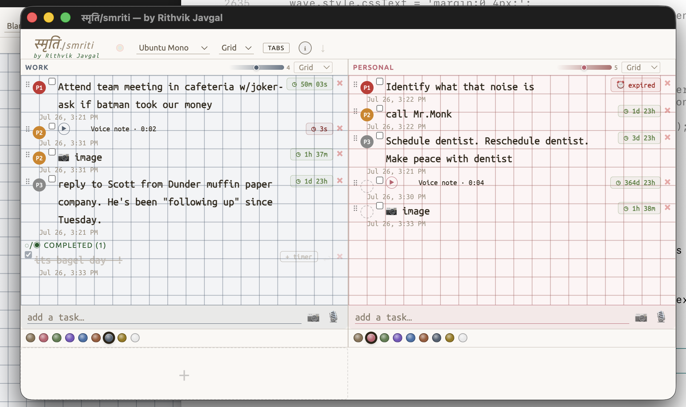
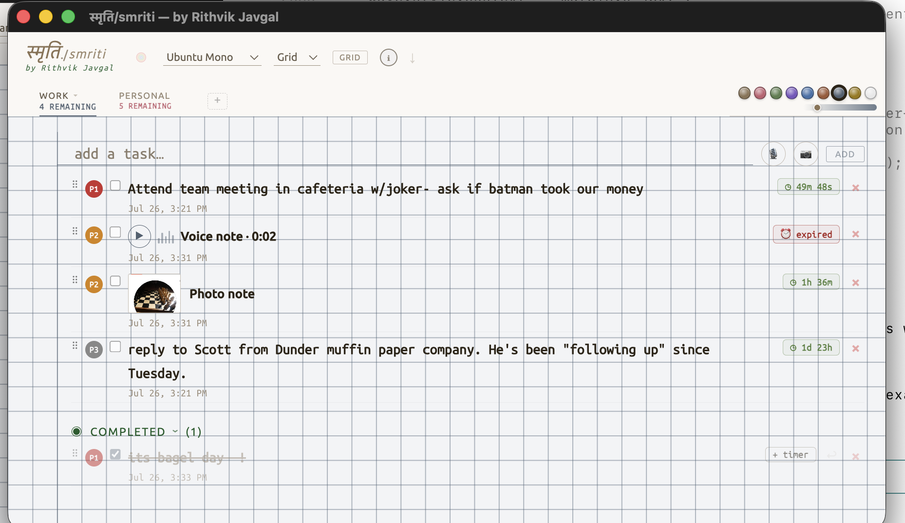

# स्मृति / smriti

**A personal notepad that lives in a single HTML file.**

No server. No cloud. No account. No subscription. No tracking. No internet required.  
Just a file on your machine that remembers things — and looks good doing it.

---

> *"smriti"* (स्मृति) — Sanskrit for **memory**.

---

## Screenshots

<!-- Screenshot 1: Grid view — both panels side by side, dot grid, ubuntu mono -->


<!-- Screenshot 2: Tab view — single panel, ruled, warm cream background -->


---

## Why smriti?

Every notes app eventually wants something from you.

Notion wants a login. Apple Notes wants iCloud. Obsidian wants a plugin ecosystem. Bear wants $2.99/month.

smriti wants nothing. It's a file. Open it. Write things. Close it. That's the whole product.

It also looks like a notebook. You're welcome.

---

## Features

### The basics
- **Up to 4 tabs** — each with its own title, color palette, and page style
- **Grid view** — see all tabs at once, side by side
- **Tab view** — focus on one tab at a time
- Task text is editable inline. Click and type. That's it.

### Page styles
Five notebook backgrounds per tab — purely decorative, text always renders on top:

| Style | What it looks like |
|---|---|
| **Ruled** | Classic college ruled. Horizontal lines, warm-toned. |
| **Graph (fine)** | Dense grid, 10px pitch. For the engineer brain. |
| **Graph (large)** | Spacious grid, 25px pitch. Slightly less intense. |
| **Dot grid** | Dots at intersections. The Leuchtturm1917 of digital notebooks. |
| **Blank** | Nothing. Pure color. Occasionally peaceful. |

### Color palettes
Nine warm palettes per tab — Cream, Rose, Sage, Lavender, Sky, Terra, Slate, Honey, Paper. Each one shifts the background, the line color, and the accent together. No jarring combinations.

### Timers per task
Each task can carry one of two timer modes:

- **Countdown** — set a duration (25 min, 2 hrs, whatever). Counts down. Turns yellow when you're getting close. Turns red when you're out of time. Pulses when it hits zero, which is both useful and mildly accusatory.
- **Deadline** — pick a date and time. Same urgency coloring. Does not judge you for setting it to "end of week" again.

### Photos and voice notes
- **Drag or paste an image** to pin it to a task — screenshots, receipts, anything
- **Record a voice note** with 🎙 — plays back inline, no file management required

### Archive
Tick a task to complete it. It slides into a collapsed **Completed** section at the bottom. Expand it when you want to feel good about yourself. Delete tasks permanently when you don't.

### Tab titles
Click any tab title and type. It's editable. Name them whatever you want. The defaults are suggestions, not requirements.

### Fonts
Eight monospace and sans-serif options. The default is Ubuntu Mono, which was the right call.

---

## Privacy

smriti is structurally private. There is no server to send your data to.

- **100% offline** — works without an internet connection, always
- **No cloud, no sync, no accounts** — nothing leaves your machine
- **No tracking, no analytics, no cookies, no telemetry** — zero
- **Your notes live only in your browser's localStorage** — invisible to everyone else
- **The entire app is one HTML file** — open source, nothing hidden

Your data is yours. Not "yours, stored on our servers." Yours.

---

## Getting started

### Option 1 — Just open it

Download `index.html`. Open it in Chrome or Safari. Done.

No install. No setup. No terminal. No npm. Nothing.

### Option 2 — Menu bar app (macOS)

For the full experience: a permanent ☀ smriti button in your macOS menu bar.

```bash
git clone https://github.com/rithviksj/smriti
cd smriti
bash build-smriti-bar.sh
```

This compiles a tiny Swift menu bar helper and installs a LaunchAgent so it starts at login.  
Click ☀ स्मृति/smriti in the menu bar to open/focus the panel. Right-click to quit.

### Option 3 — Localhost mode

For mic permissions to persist across sessions (Chrome requires a non-`file://` origin for mic access):

```bash
bash open-smriti.sh
```

Spins up a local HTTP server on port 7842 and opens smriti in Chrome app mode — no address bar, no tabs, just the app. Feels native.

---

## Data

Everything saves automatically to `localStorage` under the key `smriti_v2`.

To **back up**: open DevTools → Application → Local Storage → export the value. Or just copy the HTML file; the data lives in the browser, not the file.

To **move to another machine**: export localStorage, import it on the other machine. A one-time manual step. This is a feature, not a bug — your notes never leave without you knowing.

To **reset**: `localStorage.clear()` in the DevTools console, then reload.

---

## Tech stack

| Layer | What |
|---|---|
| HTML/CSS/JS | All inline in one file. Zero dependencies. |
| Storage | `localStorage` — browser-native, no library |
| Fonts | Google Fonts (Ubuntu Mono, Ubuntu) — loaded once, cached |
| Icons | None — everything is Unicode or hand-drawn SVG |
| Build step | None |
| Server | None |
| Framework | None |
| Complexity | Minimal, intentional |

---

## License

MIT License — Copyright © 2026 Rithvik Javgal

You are free to use, copy, modify, and distribute this software.  
You must keep the copyright notice and this license in all copies or substantial portions.

Full text: [LICENSE](LICENSE)

---

## Author

**Rithvik Javgal**  
[rithviksj@gmail.com](mailto:rithviksj@gmail.com)  
[bihag.vercel.app](https://bihag.vercel.app) — the other thing I made

---

*Built because every other notes app eventually wanted something from me.*
